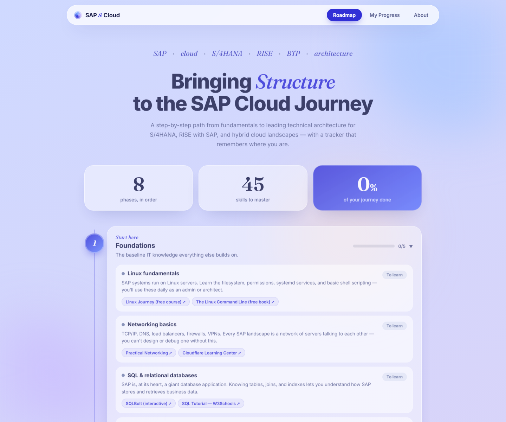

# SAP & Cloud Engineer Roadmap

A browser-based learning roadmap for people exploring SAP technical architecture and cloud engineering. It organizes 45 study topics into eight phases, links to public learning resources, and includes a personal progress tracker.



## What it does

- Browse topics from IT foundations through S/4HANA, cloud infrastructure, RISE with SAP, and operations.
- Track each topic as **To learn**, **Learning**, or **Know it**.
- Search topics and filter by progress.
- Add personal reference links and export or import a JSON backup.

## Run locally

No build step, package manager, account, or API keys are needed. Clone the repository and open `index.html` in a browser, or serve the folder with any static file server:

```bash
git clone https://github.com/hvredde-stack/sap-cloud-roadmap.git
cd sap-cloud-roadmap
python -m http.server 8000
```

Then open http://localhost:8000.

## Privacy and storage

The project is a static HTML, CSS, and JavaScript application. Progress and custom links are saved in that browser's `localStorage`; they are not sent to an application server. Use **Export** before clearing browser data or moving to another browser. A user may still choose to open an external learning link.

## Project structure

| File | Purpose |
| --- | --- |
| `index.html` | Page structure and navigation |
| `style.css` | Responsive visual styles |
| `data.js` | Roadmap phases, topics, explanations, and curated links |
| `app.js` | Search, filters, progress tracking, and import/export |

## Scope

This is an independently created study guide, not an official SAP product, certification syllabus, or guarantee of current exam coverage. SAP and cloud services change; check the linked provider documentation when planning a course or certification.
